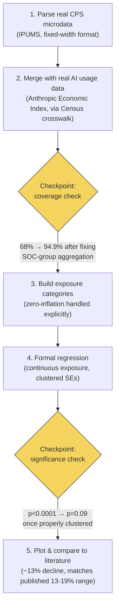

# AI Exposure and Youth Employment: A Public-Data Investigation

A public-data investigation into whether AI is associated with a hiring gap for young
workers — inspired by, and testing against, Stanford Digital Economy Lab's
["Canaries in the Coal Mine?"](https://digitaleconomy.stanford.edu) research, but built
entirely from free, publicly available data instead of private company payroll records.

## The Question

Recent Stanford research (Brynjolfsson, Chandar & Chen, 2025), using private ADP payroll
data, found that young workers in AI-exposed occupations are being hired less than their
older peers since generative AI's adoption — a 13-19% relative decline.

**This project asks: is the same pattern detectable using only public data, and how does
its size compare to the published, peer-reviewed finding?**

This is **not** a replication — Stanford's underlying payroll data is private and cannot
be reproduced. It's an independent parallel investigation, using different data and a
different (real, observed) exposure measure, to see whether the same signal is visible
from the outside.

## Workflow



## Data Sources

Every dataset used is real, public, and independently verifiable. **None of the raw data
files are included in this repo** (size and/or license terms) — see the links below and
`data/README.md` for exact steps to obtain each one.

| Dataset | What it provides | Source |
|---|---|---|
| **IPUMS CPS** | Employment, age, occupation microdata, 2022-2026 (~6M records) | [cps.ipums.org](https://cps.ipums.org/cps/) (free registration required) |
| **Anthropic Economic Index** | Real, observed AI (Claude) usage by occupation — not a predicted score | [huggingface.co/datasets/Anthropic/EconomicIndex](https://huggingface.co/datasets/Anthropic/EconomicIndex) (CC-BY license) |
| **Census OCC-to-SOC Crosswalk** | Official mapping from Census's 4-digit occupation codes to 6-digit SOC codes | [census.gov code lists page](https://www.census.gov/topics/employment/industry-occupation/guidance/code-lists.html) → "2018 Census Occupation Code List with Crosswalk" |

## Repository Structure

```
├── README.md                          <- you are here
├── requirements.txt
├── data/
│   ├── README.md                      <- exact steps to obtain each raw dataset
│   └── (raw data files go here - not committed to git)
├── scripts/
│   ├── 01_parse_cps_data.py
│   ├── 02_merge_exposure_data.py
│   ├── 03_build_exposure_categories.py
│   ├── 04_regression_analysis.py
│   └── 05_plot_results.py
└── outputs/
    ├── young_share_by_category_year.csv
    └── final_chart.png
```

## How to Run

```bash
pip install -r requirements.txt

# Get the 3 raw data files into data/ - see data/README.md for exact steps

python scripts/01_parse_cps_data.py
python scripts/02_merge_exposure_data.py
python scripts/03_build_exposure_categories.py
python scripts/04_regression_analysis.py
python scripts/05_plot_results.py
```

## Method

1. **Parse** ~6 million real CPS employment records using verified IPUMS column positions.
2. **Merge** with real, observed AI usage data (not a predicted exposure score) via an
   official government crosswalk — resolved a real coverage gap (68% → 94.9%) by properly
   aggregating broad/combined Census occupation codes per the standard SOC hierarchy.
3. **Categorize** occupations by AI exposure, explicitly handling the ~30% of the
   workforce with exactly zero observed AI use as its own group (a "zero-inflated"
   distribution) rather than force-fitting a naive quartile split.
4. **Test formally**: a weighted regression of young-worker employment probability on
   exposure level interacted with time, with standard errors clustered by occupation
   (not by individual — occupations, not people, are the real unit of variation here).
5. **Compare** the result's magnitude to the published literature.

## Findings

- **94.9%** of employed CPS respondents matched to a real AI exposure score.
- Young-worker employment share grew **+2.1 points** in the lowest-exposure occupations
  and declined **-0.5 points** in the highest-exposure occupations, 2022-2026.
- The formal regression implies a **~13% relative decline** for the highest-exposure
  occupations — at the edge of Stanford's own reported **13-19%** range.
- This result is **directionally robust** to using a different age band (25-34 instead
  of 22-25).
- The result does **not** clear the conventional 5% significance threshold once standard
  errors are properly clustered by occupation (**p ≈ 0.09**) — it is suggestive, not
  conclusive.

## Limitations

- CPS survey data has far less statistical power than Stanford's proprietary,
  worker-level payroll data for detecting an effect at this resolution.
- The Anthropic Economic Index measures Claude usage specifically, not AI usage broadly.
- ~5% of matched employment could not be linked to a specific exposure score (occupations
  absent from Anthropic's published 756-occupation list).
- October 2025 CPS data is missing (U.S. federal government shutdown) — a real, minor gap
  in the time series.
- This is a descriptive/correlational analysis; it does not establish causation.

## Citations

- Brynjolfsson, E., Chandar, B., & Chen, R. (2025). *Canaries in the Coal Mine? Six Facts
  about the Recent Employment Effects of Artificial Intelligence.* Stanford Digital
  Economy Lab.
- Anthropic Economic Index (2025-2026 releases). [huggingface.co/datasets/Anthropic/EconomicIndex](https://huggingface.co/datasets/Anthropic/EconomicIndex)
- Flood, S., King, M., Rodgers, R., Ruggles, S., Warren, J.R., et al. *IPUMS CPS: Version
  13.0* [dataset]. Minneapolis, MN: IPUMS, 2025. https://doi.org/10.18128/D030.V13.0
- U.S. Census Bureau. *2018 Census Occupation Code List with Crosswalk.*
